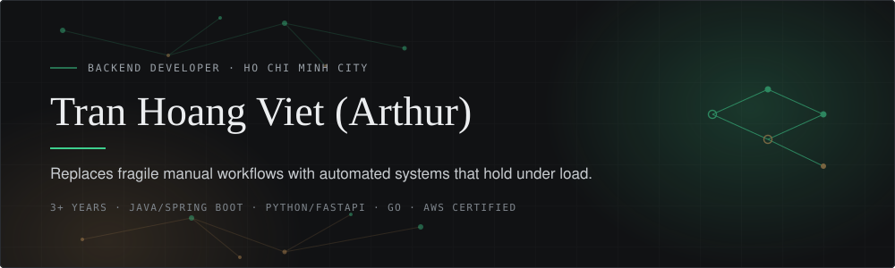

### Measured results

| | Before | After |
| :--- | :--- | :--- |
| Queue processing | 10–15 min | **2–5 min** per task |
| TLS setup | 5–10 min | **<10 sec**, unattended |
| Daily throughput | 200–250/day manual | **+350–400/day** automated |
| Code reliability | manual QA only | **≥80%** CI coverage |

Every number traces to a system I built or own.

### Selected work

**Production download queue** &nbsp;`Python · FastAPI · asyncio`
Traced a 1,700-task backlog to event-loop starvation from an unbounded in-memory queue. Moved it to a bounded, DB-backed queue with a worker pool — 10–15 min per task down to 2–5 min, retry and backoff intact.

**Zero-touch TLS agent** &nbsp;`Go · cron · nginx/apache`
Explicit state machine per domain, local-only key custody, automatic rollback if a config reload fails. Setup went from 5–10 min to under 10 sec, reissue runs unattended, CI gates merges at ≥80% coverage.

**Localization operations platform** &nbsp;`Java 17 · Spring Boot · MySQL · RabbitMQ`
Own it end to end — schema, dual JWT auth, integrations, operations. Moved task-assignment logic out of MySQL stored procedures into the service layer: ~10 min down to ~30 sec, and extensible as the rules change.

**Async file-processing API** &nbsp;`Go · Docker · OpenAPI`
Streaming I/O and chunked batch conversion keep memory flat regardless of file size. Sustains 200–300 req/min at ~250ms p99, cutting manual handling time by over 95%.

### Also

**HR Intake Platform** `FastAPI · Next.js · MongoDB · Celery` — routes Vietnamese and Korean forms into separate Google Sheets pipelines through one shared backend.

Earlier: insurance operations backend `Spring MVC` · municipal services platform `Spring Boot · React`

### Contact

[**Email**](mailto:dev@hermesxai.com) &nbsp;·&nbsp; [**LinkedIn**](https://www.linkedin.com/in/viet-tran-179bb9218/) &nbsp;·&nbsp; Ho Chi Minh City, Vietnam

Case studies omit proprietary code and client data.
