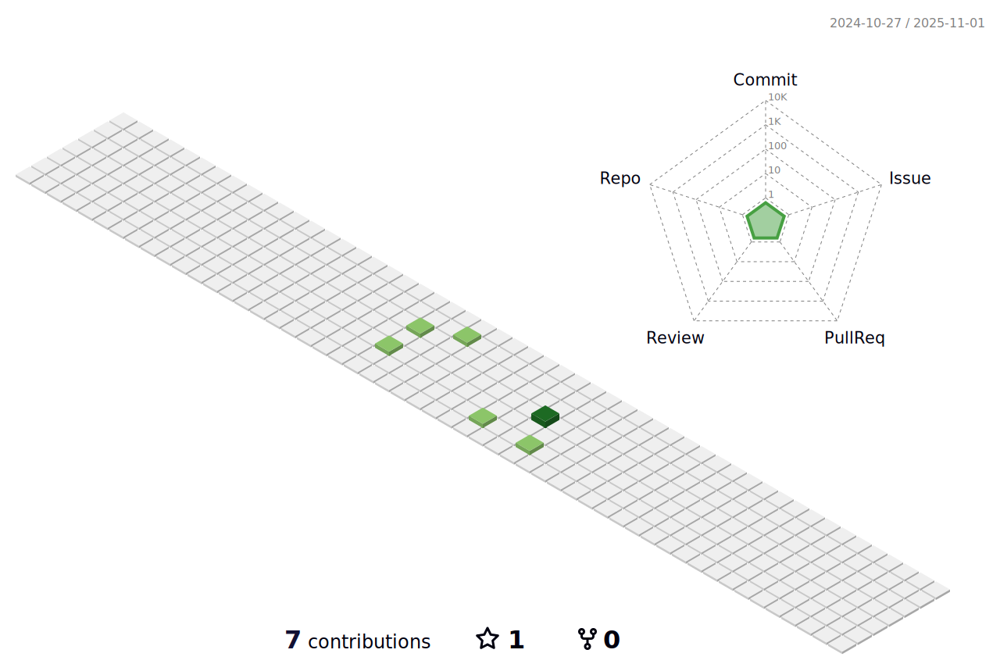

##
<h1 align="center">

</h1>

## 👨‍💻 I'm an blockchain developer 

Passionate in developing smart contracts and dApps using Solidity, tools like Truffle and Ganache and other common blockchain platform include Hyperledger Fabric and Ethereum, I'm also have experience with front-end technologies like HTML, CSS, Javascript, and other back-end technologies like Java, Nodejs, Golang. Always eager to learn more about new technology.

## 💡 A brief infor about me 

- 🌍  I'm based in Ho Chi Minh city  
- 🖥️  See my portfolio at <a href ="http://www.linkedin.com/in/viet-tran-179bb9218">ArthurTran</a> 
- ✉️  You can contact me at  <a href="gmail.com">tranviet2582@gmail.com</a>  
- 🚀  I'm currently working on <a>CyberVoting</a> 
- 🧠  I'm learning Blockchain, devops  
- 🤝  I'm open to collaborating on interesting idea project on blockchain  
- ⚡  Finance, decentralized, crypto  
 

  

## 🔥 Skills

  

## 😄 Socials

 <a href="https://www.dev.to/october_9th" target="_blank" rel="noreferrer"> <picture> <source media="(prefers-color-scheme: dark)" srcset="https://raw.githubusercontent.com/danielcranney/readme-generator/main/public/icons/socials/devdotto-dark.svg" /> <source media="(prefers-color-scheme: light)" srcset="https://raw.githubusercontent.com/danielcranney/readme-generator/main/public/icons/socials/devdotto.svg" />  </picture> </a> <a href="https://www.github.com/October-9th" target="_blank" rel="noreferrer"> <picture> <source media="(prefers-color-scheme: dark)" srcset="https://raw.githubusercontent.com/danielcranney/readme-generator/main/public/icons/socials/github-dark.svg" /> <source media="(prefers-color-scheme: light)" srcset="https://raw.githubusercontent.com/danielcranney/readme-generator/main/public/icons/socials/github.svg" />  </picture> </a> <a href="https://www.linkedin.com/in/viet-tran-179bb9218/" target="_blank" rel="noreferrer"> <picture> <source media="(prefers-color-scheme: dark)" srcset="https://raw.githubusercontent.com/danielcranney/readme-generator/main/public/icons/socials/linkedin.svg" /> <source media="(prefers-color-scheme: light)" srcset="https://raw.githubusercontent.com/danielcranney/readme-generator/main/public/icons/socials/linkedin.svg" />  </picture> </a> </a>

## ✨ Badges 

<b>My GitHub Stats</b>

<b> Top Repositories  </b>

       
